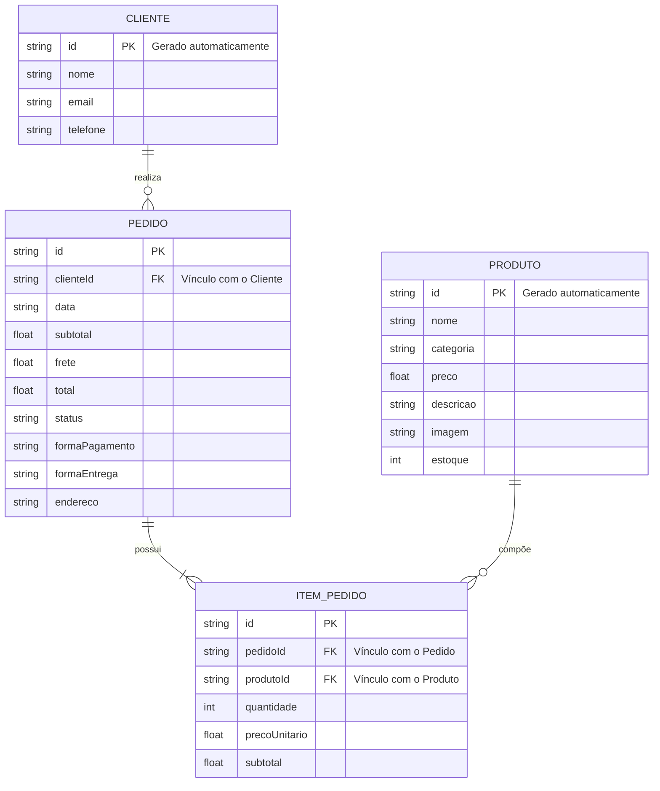

# 🛠️ Especificação Técnica (Tech Spec) - Flora Urbana

Este documento detalha a arquitetura técnica, o modelo de dados e os contratos de API (via JSON Server) necessários para o funcionamento do e-commerce **Flora Urbana**.

A aplicação utiliza uma arquitetura frontend baseada em **HTML, CSS e JavaScript**, com consumo de uma **API Fake implementada através do JSON Server** para disponibilização dos produtos e armazenamento das informações relacionadas aos pedidos.

---

## 1. Modelo de Dados (Diagrama ER)

Abaixo está o Diagrama Entidade-Relacionamento (DER) que representa a estrutura do banco de dados simulado (`db.json`) e como as informações se relacionam.



### Relacionamentos

* Um **Cliente** pode realizar vários **Pedidos**.
* Cada **Pedido** pertence a um único **Cliente**.
* Um **Pedido** possui um ou mais **Itens de Pedido**.
* Cada **Item de Pedido** está relacionado a um único **Produto**.
* Um **Produto** pode aparecer em vários **Itens de Pedido**.
* O preço utilizado no item é armazenado no momento da compra para manter o histórico do pedido.

---

## 2. Dicionário de Dados

Breve explicação das principais entidades utilizadas pela aplicação.

### 🌱 Produtos

Responsável por armazenar as informações dos produtos comercializados pela Flora Urbana.

* **id:** Identificador único do produto, gerado pelo JSON Server.
* **nome:** Nome comercial da planta ou produto.
* **categoria:** Categoria à qual o produto pertence, como "Plantas", "Vasos", "Acessórios" ou "Jardinagem".
* **preco:** Valor de venda do produto, armazenado como número decimal (Float).
* **descricao:** Descrição e informações relevantes sobre o produto.
* **imagem:** Caminho ou URL da imagem utilizada na apresentação do produto.
* **estoque:** Quantidade disponível do produto para venda.

### 👤 Clientes

Responsável por armazenar os dados básicos dos clientes que realizam pedidos.

* **id:** Identificador único do cliente.
* **nome:** Nome completo do cliente.
* **email:** Endereço de e-mail utilizado para contato.
* **telefone:** Número de telefone do cliente.

### 🛒 Pedidos

Responsável por registrar as compras realizadas pelos clientes.

* **id:** Identificador único do pedido.
* **clienteId:** Chave estrangeira que relaciona o pedido ao cliente responsável pela compra.
* **data:** Data de criação do pedido no formato ISO (`YYYY-MM-DD`).
* **subtotal:** Soma dos valores dos produtos antes do frete.
* **frete:** Valor cobrado pela entrega.
* **total:** Valor final do pedido, considerando subtotal e frete.
* **status:** Situação atual do pedido, como "PENDENTE", "CONFIRMADO" ou "CANCELADO".
* **formaPagamento:** Método de pagamento selecionado pelo cliente.
* **formaEntrega:** Método de entrega escolhido pelo cliente.
* **endereco:** Endereço utilizado para entrega do pedido.

### 📦 Itens do Pedido

Responsável por registrar individualmente cada produto presente em um pedido.

* **id:** Identificador único do item.
* **pedidoId:** Chave estrangeira que relaciona o item ao pedido.
* **produtoId:** Chave estrangeira que identifica o produto comprado.
* **quantidade:** Quantidade do produto adicionada ao pedido.
* **precoUnitario:** Preço do produto no momento da compra.
* **subtotal:** Resultado da multiplicação do preço unitário pela quantidade.

### ⚠️ Regra de Negócio Crítica

A quantidade solicitada pelo cliente **não pode ultrapassar o estoque disponível**.

O cálculo de cada item deve seguir a fórmula:

```text
subtotal = precoUnitario × quantidade
```

O valor final do pedido deve seguir:

```text
total = subtotal + frete
```

---

## 3. Rotas da API (JSON Server)

A aplicação consome uma API local simulada pelo JSON Server. Abaixo estão os principais endpoints utilizados pelo sistema.

### 🌱 Produtos

* `GET /produtos` — Retorna todos os produtos disponíveis.
* `GET /produtos/:id` — Retorna os dados de um produto específico.
* `POST /produtos` — Cadastra um novo produto.
* `PUT /produtos/:id` — Atualiza os dados de um produto.
* `DELETE /produtos/:id` — Remove um produto.

### 👤 Clientes

* `GET /clientes` — Retorna a lista de clientes.
* `GET /clientes/:id` — Retorna um cliente específico.
* `POST /clientes` — Cadastra um novo cliente.
* `PUT /clientes/:id` — Atualiza os dados de um cliente.

### 🛒 Pedidos

* `GET /pedidos` — Retorna todos os pedidos cadastrados.
* `GET /pedidos/:id` — Retorna um pedido específico.
* `GET /pedidos?clienteId=1` — Retorna os pedidos de um cliente específico.
* `POST /pedidos` — Registra um novo pedido.
* `PUT /pedidos/:id` — Atualiza um pedido.
* `DELETE /pedidos/:id` — Remove um pedido.

### 📦 Itens do Pedido

* `GET /itensPedido` — Retorna todos os itens dos pedidos.
* `GET /itensPedido?pedidoId=1` — Retorna os itens pertencentes a um pedido específico.
* `POST /itensPedido` — Cadastra um novo item de pedido.
* `PUT /itensPedido/:id` — Atualiza um item.
* `DELETE /itensPedido/:id` — Remove um item.

---

## 4. Estrutura do Banco de Dados (db.json)

Esta é a representação em formato JSON do banco de dados simulado.

A estrutura serve de contexto para ferramentas de IA e para o **JSON Server** inicializar a API Fake.

```json
{
  "clientes": [
    {
      "id": "1",
      "nome": "Maria Silva",
      "email": "maria@email.com",
      "telefone": "(42) 99999-9999"
    }
  ],

  "produtos": [
    {
      "id": "1",
      "nome": "Costela-de-Adão",
      "categoria": "Plantas",
      "preco": 89.90,
      "descricao": "Planta ornamental ideal para ambientes internos.",
      "imagem": "img/produtos/costela-de-adao.jpg",
      "estoque": 10
    },
    {
      "id": "2",
      "nome": "Jiboia",
      "categoria": "Plantas",
      "preco": 49.90,
      "descricao": "Planta de fácil cultivo e ótima para ambientes internos.",
      "imagem": "img/produtos/jiboia.jpg",
      "estoque": 15
    },
    {
      "id": "3",
      "nome": "Vaso de Cerâmica",
      "categoria": "Vasos",
      "preco": 59.90,
      "descricao": "Vaso de cerâmica para decoração e cultivo de plantas.",
      "imagem": "img/produtos/vaso-ceramica.jpg",
      "estoque": 8
    }
  ],

  "pedidos": [
    {
      "id": "1",
      "clienteId": "1",
      "data": "2026-09-13",
      "subtotal": 139.80,
      "frete": 15.00,
      "total": 154.80,
      "status": "CONFIRMADO",
      "formaPagamento": "PIX",
      "formaEntrega": "ENTREGA_PADRAO",
      "endereco": "Rua das Flores, 100 - Centro"
    }
  ],

  "itensPedido": [
    {
      "id": "1",
      "pedidoId": "1",
      "produtoId": "1",
      "quantidade": 1,
      "precoUnitario": 89.90,
      "subtotal": 89.90
    },
    {
      "id": "2",
      "pedidoId": "1",
      "produtoId": "2",
      "quantidade": 1,
      "precoUnitario": 49.90,
      "subtotal": 49.90
    }
  ]
}
```

---

## 5. Regras de Cálculo

O sistema deverá realizar automaticamente os cálculos relacionados ao carrinho e ao pedido.

### Subtotal do produto

```text
subtotalItem = preço do produto × quantidade
```

### Subtotal do pedido

```text
subtotalPedido = soma dos subtotais de todos os itens
```

### Valor total

```text
totalPedido = subtotalPedido + frete
```

Exemplo:

```text
Produto 1: R$ 89,90 × 1 = R$ 89,90
Produto 2: R$ 49,90 × 1 = R$ 49,90

Subtotal: R$ 139,80
Frete:    R$ 15,00
------------------
Total:    R$ 154,80
```

---

## 6. Fluxo Técnico da Compra

O fluxo principal da aplicação deverá seguir as seguintes etapas:

```text
┌─────────────────────┐
│   Página Inicial    │
└──────────┬──────────┘
           │
           ▼
┌─────────────────────┐
│ Catálogo de Produtos│
└──────────┬──────────┘
           │
           ▼
┌─────────────────────┐
│ Detalhes do Produto │
└──────────┬──────────┘
           │
           ▼
┌─────────────────────┐
│ Adicionar ao Carrinho│
└──────────┬──────────┘
           │
           ▼
┌─────────────────────┐
│  Carrinho de Compras│
└──────────┬──────────┘
           │
           ▼
┌─────────────────────┐
│      Checkout       │
└──────────┬──────────┘
           │
           ▼
┌─────────────────────┐
│ Dados de Entrega    │
│ e Pagamento         │
└──────────┬──────────┘
           │
           ▼
┌─────────────────────┐
│ Revisão do Pedido   │
└──────────┬──────────┘
           │
           ▼
┌─────────────────────┐
│ Finalizar Pedido    │
└──────────┬──────────┘
           │
           ▼
┌─────────────────────┐
│ Confirmação da      │
│ Compra              │
└─────────────────────┘
```

---

## 7. Persistência do Carrinho

O carrinho de compras será armazenado localmente no navegador utilizando o **Web Storage (`localStorage`)**.

Exemplo de estrutura:

```json
[
  {
    "produtoId": "1",
    "nome": "Costela-de-Adão",
    "preco": 89.90,
    "quantidade": 2,
    "subtotal": 179.80
  },
  {
    "produtoId": "2",
    "nome": "Jiboia",
    "preco": 49.90,
    "quantidade": 1,
    "subtotal": 49.90
  }
]
```

A utilização do `localStorage` permite que os produtos permaneçam no carrinho mesmo após o usuário atualizar a página.

---

## 8. Validação de Estoque

Antes de adicionar um produto ao carrinho, o sistema deverá verificar a quantidade disponível na API.

Exemplo:

```text
Estoque disponível: 5 unidades
Quantidade solicitada: 3 unidades

Resultado: permitido
```

Caso o cliente tente adicionar uma quantidade superior:

```text
Estoque disponível: 5 unidades
Quantidade solicitada: 7 unidades

Resultado: operação bloqueada
Mensagem: "Quantidade indisponível em estoque."
```

A mesma validação deverá ser realizada durante a finalização do pedido.

---

## 9. Status dos Pedidos

Os pedidos poderão assumir os seguintes estados:

| Status       | Descrição                             |
| ------------ | ------------------------------------- |
| `PENDENTE`   | Pedido criado, aguardando confirmação |
| `CONFIRMADO` | Pedido finalizado com sucesso         |
| `CANCELADO`  | Pedido cancelado                      |

O status inicial de um pedido poderá ser definido como `PENDENTE`, sendo atualizado para `CONFIRMADO` após a conclusão do processo de checkout.

---

## 10. Formas de Pagamento

Para fins de simulação acadêmica, o sistema poderá disponibilizar as seguintes opções:

* `PIX`
* `CARTAO_CREDITO`
* `CARTAO_DEBITO`

As informações de pagamento não serão processadas por instituições financeiras reais.

O sistema deverá apenas registrar a opção selecionada pelo usuário.

---

## 11. Formas de Entrega

A aplicação poderá disponibilizar diferentes opções de entrega, como:

* `ENTREGA_PADRAO`
* `ENTREGA_EXPRESSA`
* `RETIRADA_LOJA`

Cada opção poderá possuir um valor de frete diferente.

Exemplo:

```text
Entrega padrão:  R$ 15,00
Entrega expressa: R$ 25,00
Retirada na loja: R$ 0,00
```

---

## 12. Integração com API Fake

O frontend deverá realizar requisições assíncronas para o JSON Server utilizando JavaScript.

Exemplo de consulta de produtos:

```javascript
fetch("http://localhost:3000/produtos")
  .then(response => response.json())
  .then(produtos => {
    console.log(produtos);
  })
  .catch(error => {
    console.error("Erro ao carregar produtos:", error);
  });
```

A aplicação deverá tratar possíveis erros de comunicação com a API e informar o usuário quando os dados não puderem ser carregados.

---

## 13. Considerações Técnicas

* O **JSON Server** será utilizado exclusivamente como API Fake para fins acadêmicos.
* O `db.json` representa o banco de dados simulado da aplicação.
* O `localStorage` será utilizado para manter o carrinho no navegador.
* O JavaScript será responsável pela lógica de negócio no frontend.
* O cálculo dos valores deverá ser realizado dinamicamente.
* A quantidade de produtos deverá respeitar o estoque disponível.
* As informações reais de cartão de crédito não deverão ser armazenadas.
* A aplicação deverá ser responsiva para dispositivos móveis e desktop.
* A estrutura do código deverá permanecer modularizada para facilitar manutenção e evolução.

---

## 14. Resumo da Arquitetura

```text
┌───────────────────────────────────┐
│             USUÁRIO               │
└─────────────────┬─────────────────┘
                  │
                  ▼
┌───────────────────────────────────┐
│            FRONTEND               │
│                                   │
│       HTML + CSS + JavaScript     │
│              + jQuery             │
└───────────────┬───────────────────┘
                │
        ┌───────┴────────┐
        │                │
        ▼                ▼
┌───────────────┐  ┌────────────────┐
│  localStorage │  │   JSON Server  │
│               │  │    API Fake    │
│    Carrinho   │  │                │
└───────────────┘  └───────┬────────┘
                           │
                           ▼
                    ┌──────────────┐
                    │    db.json   │
                    │              │
                    │ Produtos     │
                    │ Clientes     │
                    │ Pedidos      │
                    │ Itens Pedido │
                    └──────────────┘
```

A arquitetura foi projetada para manter uma separação clara entre **interface, lógica de aplicação, armazenamento local e fonte de dados**, permitindo que a Flora Urbana cumpra seu objetivo como projeto acadêmico de e-commerce.
